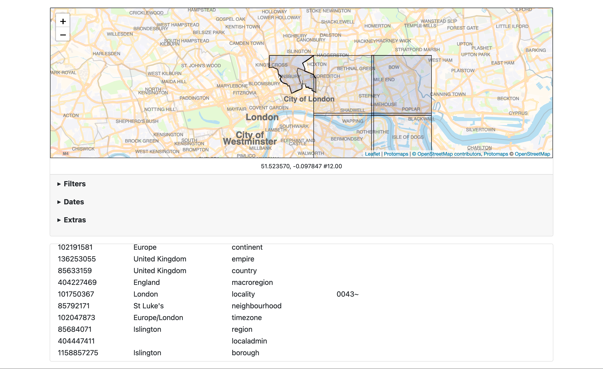

# http-server

```
$> ./bin/http-server -h
  -authenticator-uri string
    	A valid sfomuseum/go-http-auth URI. (default "null://")
  -cors-allow-credentials
    	Allow HTTP credentials to be included in CORS requests.
  -cors-origin value
    	One or more hosts to allow CORS requests from; may be a comma-separated list.
  -custom-placetypes string
    	A JSON-encoded string containing custom placetypes defined using the syntax described in the whosonfirst/go-whosonfirst-placetypes repository.
  -enable-cors
    	Enable CORS headers for data-related and API handlers.
  -enable-custom-placetypes
    	Enable wof:placetype values that are not explicitly defined in the whosonfirst/go-whosonfirst-placetypes repository.
  -enable-geojson
    	Enable GeoJSON output for point-in-polygon API calls.
  -enable-gzip
    	Enable gzip-encoding for data-related and API handlers.
  -enable-www
    	Enable the interactive /debug endpoint to query points and display results.
  -is-wof
    	Input data is WOF-flavoured GeoJSON. (Pass a value of '0' or 'false' if you need to index non-WOF documents. (default true)
  -iterator-uri string
    	A valid whosonfirst/go-whosonfirst-iterate/v2 URI. Supported schemes are: directory://, featurecollection://, file://, filelist://, geojsonl://, null://, repo://. (default "repo://")
  -leaflet-initial-latitude float
    	The initial latitude for map views to use. (default 37.616906)
  -leaflet-initial-longitude float
    	The initial longitude for map views to use. (default -122.386665)
  -leaflet-initial-zoom int
    	The initial zoom level for map views to use. (default 14)
  -leaflet-max-bounds string
    	An optional comma-separated bounding box ({MINX},{MINY},{MAXX},{MAXY}) to set the boundary for map views.
  -log-timings
    	Emit timing metrics to the application's logger
  -map-provider-uri string
    	A valid aaronland/go-http-maps/provider URI. (default "leaflet://?leaflet-tile-url=https://tile.openstreetmap.org/{z}/{x}/{y}.png")
  -path-api string
    	The root URL for all API handlers (default "/api")
  -path-data string
    	The URL for data (GeoJSON) handler (default "/data")
  -path-ping string
    	The URL for the ping (health check) handler (default "/health/ping")
  -path-pip string
    	The URL for the point in polygon web handler (default "/point-in-polygon")
  -path-prefix string
    	Prepend this prefix to all assets (but not HTTP handlers). This is mostly for API Gateway integrations.
  -properties-reader-uri string
    	A valid whosonfirst/go-reader.Reader URI. Available options are: [fs:// null:// pmtiles:// repo:// sqlite:// stdin://]. If the value is {spatial-database-uri} then the value of the '-spatial-database-uri' implements the reader.Reader interface and will be used.
  -server-uri string
    	A valid aaronland/go-http-server URI. (default "http://localhost:8080")
  -spatial-database-uri string
    	A valid whosonfirst/go-whosonfirst-spatial/data.SpatialDatabase URI. options are: [pmtiles:// rtree:// sqlite://] (default "rtree://")
```

## Example

```
$> bin/http-server \
	-spatial-database-uri 'pmtiles://?tiles=file:///usr/local/data&database=wof' \
	-enable-www
	
2022/12/16 14:19:51 Register /data/ handler
2022/12/16 14:19:51 Register /api/point-in-polygon handler
2022/12/16 14:19:51 time to index paths (0) 3.471µs
2022/12/16 14:19:51 finished indexing in 231µs
2022/12/16 14:19:51 Prune tile cache older that 2022-12-16 14:14:51.570246 -0800 PST m=-299.955191662
2022/12/16 14:19:51 Register /point-in-polygon handler
2022/12/16 14:19:51 Register / handler
2022/12/16 14:19:51 Listening on http://localhost:8080
```

When you visit `http://localhost:8080` in your web browser you should see something like this:


If you don't need, or want, to expose a user-facing interface simply remove the `-enable-www`, `-map-provider` and `-nextzen-apikey` flags. For example:

```
$> ./bin/http-server \
	-spatial-database-uri 'pmtiles://?tiles=file:///usr/local/data&database=wof'

2022/11/26 09:57:03 Register /data/ handler
2022/11/26 09:57:03 Register /api/point-in-polygon handler
2022/11/26 09:57:03 Listening on http://localhost:8080
2022/11/26 09:57:03 time to index paths (0) 83.545µs
2022/11/26 09:57:03 finished indexing in 618.003µs
```

And then:

```
$> curl -s http://localhost:8080/api/point-in-polygon \
	-d '{"latitude": 37.621131, "longitude": -122.384292}' \

| jq '.places[]["wof:name"]'

"Earth"
"United States"
"San Francisco International Airport"
"California"
"North America"
"San Mateo"
"94128"
```

If you have created your Protomaps database with custom properties and want to be able to access them via the API you will need to ensure that your `spatial-database-uri` flag has a "enable-cache=true" query parameter and that you assign the value of "{spatial-database-uri}" to the `properties-reader-uri` flag. For example:

```
$> ./bin/http-server \
	-spatial-database-uri 'pmtiles://?tiles=file:///usr/local/data&database=wof&enable-cache=true' \
	-properties-reader-uri '{spatial-database-uri}'
```

By default, results are returned as a list of ["standard places response"](https://github.com/whosonfirst/go-whosonfirst-spr/) (SPR) elements. You can also return results as a GeoJSON `FeatureCollection` by passing the `-enable-geojson` flag to the server and including a `format=geojson` query parameter with requests. For example:

```
$> bin/http-server \
	-spatial-database-uri 'pmtiles://?tiles=file:///usr/local/data&database=wof'
	-enable-geojson
```

However, and this important to note: Geometries are cropped to the boundaries of the _first tile_ that the feature they are associated with. That is to say not only are geometries cropped to the boundaries of a tile but they are cached locally so, for example, the "geometry" for the United States would be the first tile that contained it untile the local cache expires. For example:



If you really need to geometry for a given feature you should fetch it directly from `https://data.whosonfirst.org/geojson/{ID}` or some other equivalent data source.

## AWS

### Lambda

It is possible to deploy the `server` tool as a Lambda function, reading from a Protomaps database hosted in an S3 bucket. The Lambda function does not need any special permissions beyond the ability to read files in the S3 bucket you've chosen.

In the "configuration" section you'll need to assign the following variables in the "Environment variables" sub-menu:

| Key | Value | Notes | 
| --- | --- | --- |
| WHOSONFIRST_ENABLE_WWW | `true` | |
| WHOSONFIRST_ENABLE_CORS | true | |
| WHOSONFIRST_CORS_ORIGIN | * | Or configure to taste. |
| WHOSONFIRST_LOG_TIMINGS | true | Or not. |
| WHOSONFIRST_PATH_PREFIX | _string_ | This should match the name of API Gateway deployment "stage" (discussed below) you associate with your Lambda function. |
| WHOSONFIRST_PROPERTIES_READER_URI | {spatial-database-uri} | |
| WHOSONFIRST_SERVER_URI | lambda:// | It is only necessary to set this is you are using your Lambda function in conjunction with an API Gateway integration, described below. If not leave empty and add a valid [awslabs/aws-lambda-web-adapter](https://github.com/awslabs/aws-lambda-web-adapter). |
| WHOSONFIRST_SPATIAL_DATABASE_URI | pmtiles://?tiles={TILES_URI}&database={DATABASE} | See below for a discussion of the value of `{TILES_URI}` |

Under the hood the value of the `?tiles=` query parameter in the `-spatial-database-uri` (or `WHOSONFIRST_SPATIAL_DATABASE_URI`) flag is just a [gocloud.dev/blob](https://gocloud.dev/howto/blob/) URI so data can be read from any source that implements that package's [Blob](https://pkg.go.dev/gocloud.dev/blob) interfaces. The default supported URIs are `file://` for reading data from the local filesystem and `s3://` and `s3blob://` for reading data from an S3 bucket. The difference between `s3://` and `s3blob://` is that the latter allows AWS credentials to be defined as a query parameter. For example:

```
s3blob://{S3_BUCKET}?region={AWS_REGION}&prefix={PREFIX}&credentials={CREDENTIALS}
```

A concrete example, reading data from an S3 bucket called `example` in a folder called `tiles/` in the AWS `us-east-1` region, specifying an AWS credentials profile called `example` would be:

```
s3blob://example?region=us-east-1&prefix=tiles/&credentials=example
```

Unfortunately, because the URI contains its own query parameters, it needs to be URL-encoded before it is included in the final `-spatial-database-uri` URI. Putting it altogether we end up with this:

```
pmtiles://?tiles=s3blob%3A%2F%2Fexample%3Fregion%3Dus-east-1%26prefix%3Dtiles%2F%26credentials%3Dexample&database=example
```

You can also specify any of the other flags that the `server` tool accepts. The rules for assigning a command line flag as a environment variable are:

* Replace all `-` characters with `_` characters.
* Prepend the string `whosonfirst_` to the variable name.
* Upper-case the new string. For example the `-leaflet-initial-zoom` becomes `WHOSONFIRST_LEAFLET_INITIAL_ZOOM`.

In the "Generation configuration" sub-menu change the default timeout to something between 10-30 seconds (or more) depending on your specific use case.

That should be all you need to do. You can test the set up by running the function and passing an empty message (`{}`). Nothing will happen but the function will exit without any errors.

### API Gateway

_The use of API Gateway works but it's like a thousand times easier to use a Lambda Function URL in conjunction with the [awslabs/aws-lambda-web-adapter](https://github.com/awslabs/aws-lambda-web-adapter)._

Create a new "REST" API. For the sake of this example we'll call it `Architecture` (to match the container and Lambda function described above).

* Create a new "Resource" and configure it "as proxy resource".
* Delete the `ANY` method that will be automatically associated with the newly created resource (it will be labeled `{proxy+}`.
* Create a new `GET` on the resource and set the "Integration type" to be `Lambda Function` and associate the Lambda function you've just created above with the resource.
* Create a new `POST` on the resource and set the "Integration type" to be `Lambda Function` and associate the Lambda function you've just created above with the resource.
* Create a new `GET` method on the root `/` resource. Configure the "Integration type" to be a "Lambda function" and check the "Use Lambda Proxy integration" button. Associate the Lambda function you've just created above with the resource.
* One the method is created click the "Method response" tab and add a new "Response Body" for HTTP `200` status response. The "Content type" should be `text/html` and the "Model" should be `Empty`.
* Create a new "Deployment stage". For the sake of this example we'll call it `architecture` to match the `WHOSONFIRST_PATH_PREFIX` environment variable in the Lambda function, described above.
* Deploy the API.

Once deployed the `server` tool will be available at a URL like `{PREFIX}.execute-api.us-east-1.amazonaws.com/architecture`. For example:

* https://{PREFIX}.execute-api.us-east-1.amazonaws.com/architecture/
* https://{PREFIX}.execute-api.us-east-1.amazonaws.com/architecture/point-in-polygon/

## See also

* https://github.com/whosonfirst/go-whosonfirst-spatial-www